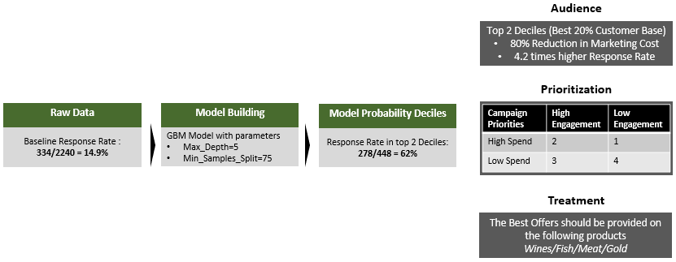
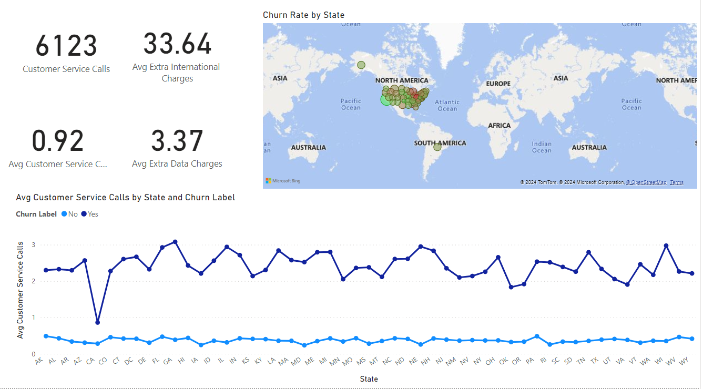
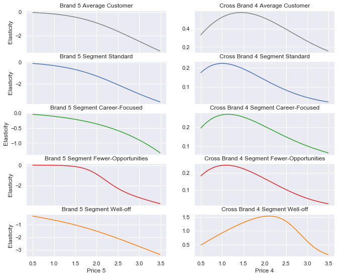
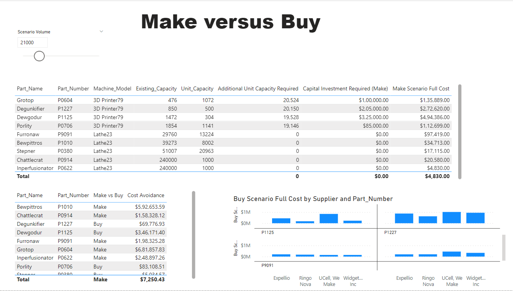
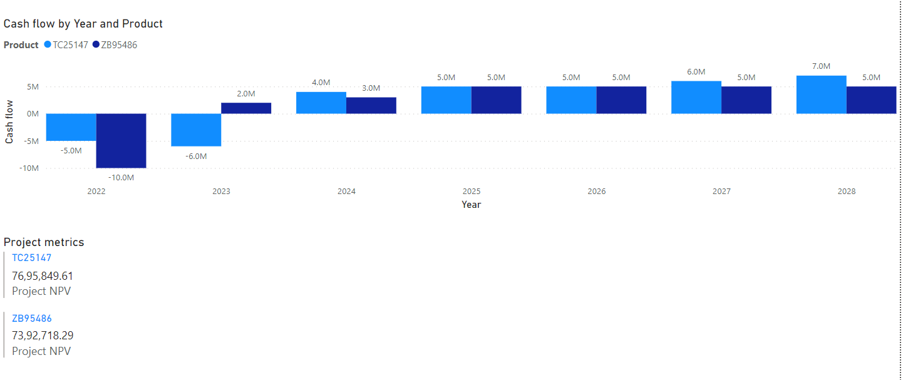
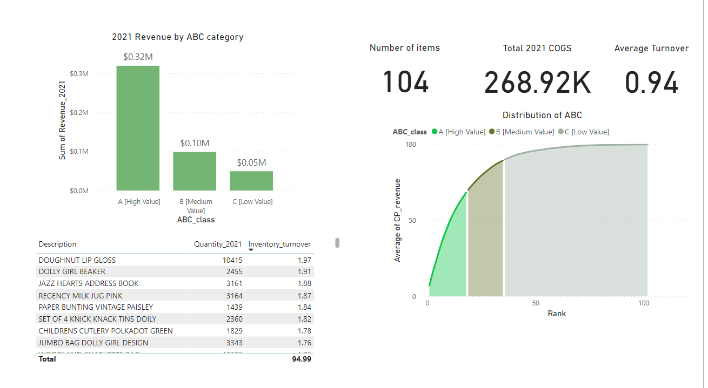
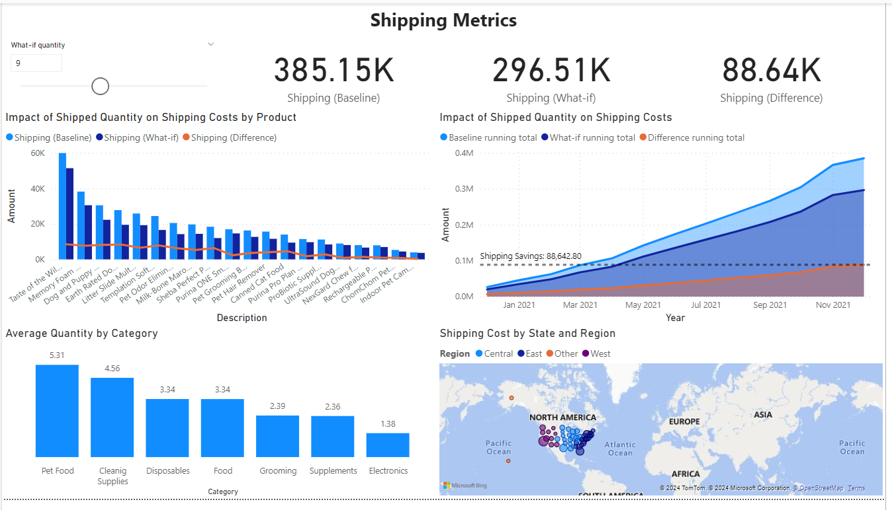

# My-Portfolio
# Data Analyst
Proficient in analyzing and interpreting data to drive business decision-making and optimize processes.

### Technical Skills:
Python, MySQL, Power BI, Excel, Data Analysis, Data Visualization ,DAX, Web scraping,Statistics.

### Work Experience:
Software Engineer @Techgemini Info Services (Aug 2015- Nov 2018)

• Worked with software development and testing team members to design and develop 90 percent accurate robust solutions to meet client requirements for functionality, scalability and performance.

• Contributed to the development of company's flagship product, TecERP
software, delivered the project on time and within budget increasing the customer satisfaction by 25% and reducing the onboard time by 10%.

• Authored detailed technical documentation for the 70 % CRM module of TecERP software, providing clear guidelines and instructions for its customisations.

Data Analyst Intern @ Edure (Jan 2019- June 2020)

• Conducted data cleaning and preprocessing tasks to ensure the 80% accuracy and integrity of datasets used for analysis.

• Utilized various statistical and  important machine learning techniques to perform in- depth data analysis and extract meaningful insights.

• Delivered comprehensive training sessions to 50 + students, imparting knowledge
in data analysis techniques, model building, and evaluation methodologies.

• Mentored and guided 20 + students' projects, offering guidance and support throughout the project lifecycle.

### Projects:

### [Response modelling Project:](https://github.com/RajeshShankar23/Response-Modelling-Project)

• Developed a response model for a supermarket's marketing campaigns, aimed at improving the
response rate by 20% and maximizing profitability.

• Conducted exploratory data analysis (EDA) to gain insights into the data characteristics, and calculated the baseline event rate to be 14.9%.
• Cleaned and preprocessed the data then built
different models and selected GBM as the best model with 86% accuracy.

• Evaluated model's probability discrimination, finding that 58% of responders are concentrated in the first decile.

• Discovered the top 10 drivers impacting the
response, including income, product purchase behaviors, and marital status.

• Prioritized customers based on their engagement levels and spend categories, and tailored treatments by recommending offers for specific product categories.

### [Churn Analytics Project:](https://github.com/RajeshShankar23/Churn-Analysis)

• The churn analysis for Databel involved a comprehensive approach, including data verification, identifying churn factors, regional and demographic analysis, and evaluating the impact of contract types and service offerings.

• Insights revealed key drivers of churn such as competitive offerings and customer service quality, along with regional and demographic variations.

• Recommendations focus on improving competitive positioning, enhancing customer service experiences, promoting contract stability, and implementing targeted retention strategies to mitigate churn and enhance overall business performance.

### [Customer Analytics Project:](https://github.com/RajeshShankar23/Customer-Analytics)

• The project involved three key modeling approaches: Purchase Incidence Modeling, Brand Choice Modeling, and Purchase Quantity Modeling, employing logistic regression and multinomial logistic regression to predict purchase probabilities and brand choices.

• Insights revealed varying levels of price sensitivity among different customer segments and highlighted brand preferences and potential substitutes, informing targeted marketing strategies.

• Recommendations include incorporating additional features for more accurate predictions, conducting granular segmentation analysis, and exploring alternative modeling techniques to optimize marketing strategies and increase profitability in the competitive marketplace.

### [Supply Chain Analytics Project:](https://github.com/RajeshShankar23/Supply-Chain-Analytics)

• The project at Ternate Industries involved a detailed analysis of the make versus buy decision for replacement parts of industrial pizza ovens

• Through quotes analysis, supplier exploration, and scenario analysis tools, the team identified cost trends, supplier contributions, and evaluated the full costs of internal production estimates to make informed decisions.

• Insights highlighted the importance of supplier optimization, dynamic scenario analysis, and internal production efficiency to maximize cost savings and maintain competitiveness in the market.

### [Financial Analysis Project:](https://github.com/RajeshShankar23/Financial-Analysis)

• The financial analytics report for Spaero Technology utilized a range of analytical techniques including profitability analysis, revenue performance evaluation, and customer analytics to provide comprehensive insights into the company's financial health and strategic opportunities. 

• Key findings highlighted pricing strategies to boost sales volume, targeted marketing approaches based on customer distribution, and investment prioritization based on capital budgeting metrics like NPV and IRR. 

• Recommendations focused on adjusting pricing strategies, expanding market presence, continuing scenario analysis for forecasting, and prioritizing investments for maximum returns, all aimed at fostering sustainable growth and profitability for Spaero Technology.

### [Inventory Analytics Project:](https://github.com/RajeshShankar23/Inventory-Analysis)

• The inventory analytics report conducted for WarmeHands Incorporated employed data cleaning and key metric calculations to evaluate the company's financial performance in 2020 and 2021. 

• Detailed analysis revealed top-selling items, shifts in revenue percentages, and the significance of high-value items identified through ABC analysis. 

• Recommendations focused on prioritizing high-value items for inventory management, streamlining inventory by discontinuing low-value items, and optimizing purchasing decisions based on COGS to revenue ratio analysis. 

• Additionally, suggestions were made for reassessing underperforming categories, optimizing medium-value items, and developing a dashboard for informed decision-making.

### [E-commerce Analysis Project:](https://github.com/RajeshShankar23/E-Commerce-Analysis-in-PowerBI)

• The e-commerce analysis project focused on driving sales growth, reducing operational costs, and enhancing customer satisfaction for the client's online pet supply store.

• Leveraging Power BI, the project involved analyzing sales data, implementing quantity-based promotions, and segmenting customers using RFM analysis.

• Recommendations included targeting regions with high shipping costs for optimization, implementing promotional strategies tailored to product categories, and enhancing customer engagement through loyalty programs

• By implementing these strategies, the project aimed to drive sustainable growth and profitability in the competitive e-commerce landscape.

### Other Projects:

### [Retail Customer Analytics Project:](https://github.com/RajeshShankar23/Retail-Customer-Analytics)

### [Retail Management Project:](https://github.com/RajeshShankar23/Retail-Management)

### [Bank Loan Case Study:](https://github.com/RajeshShankar23/Bank-Loan-Case-Study)

### [Car Price Analytics Project:](https://github.com/RajeshShankar23/Car-Price-Analytics)

